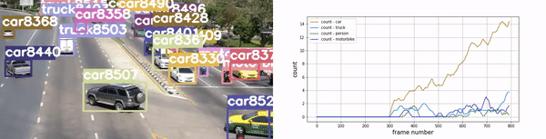

# Street Vision :eye:
deep-learning based data extraction from surveillance videos.

The gif below showcases the capabilities of our model. The raw video is sourced from youtube - [link](https://www.youtube.com/watch?v=jjlBnrzSGjc&ab_channel=Panasonicsecurity), check out the predictions over the whole video - [link](https://www.youtube.com/watch?v=3lAxH-fQ90I&ab_channel=MainakDeb)

   

### Summary:  ✨  
The goal of the project is to generate valuable insights from the public surveillance videos and store them in a comfortable CSV record dependent on time and frames. The collected insights can be presented in any comfortable way like a dashboard or can be used for analysing data for future developments in the area under surveillance in terms of traffic control, accident prevention, road expansion etc.
### Generated plots:
we tested our model on [this video](https://www.youtube.com/watch?v=jjlBnrzSGjc&ab_channel=Panasonicsecurity) from youtube, here are the inferences:

   
### Storing data:
We're recording the acquired insights in form of a CSV file for easy exporting and storage. People who are not familiar with coding can use Microsoft Excel or Libre Office to handle the output CSV files. Here's how our output file looks:

Each column represents a class of object and each row corresponds to a frame in the input video. The values represent the number of occurences of objects of each class frame-by-frame. Take a look at the last row (in the image above), it conveys the presence of 16 unique cars and 1 truck in the last frame.

  
-----  
### Ingredients  🥗  

👉🏽  PyTorch  
👉🏽  YoloNetv3    
👉🏽  Pandas  
👉🏽  OpenCV  
👉🏽  SciPy  
👉🏽  Matplotlib    
👉🏽  Tqdm
  
-----  
